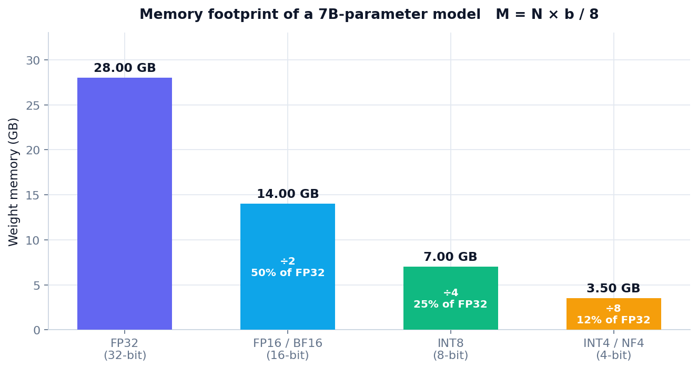
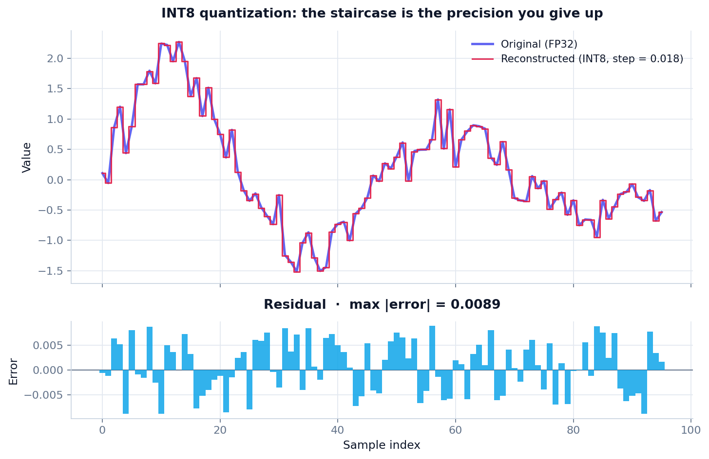
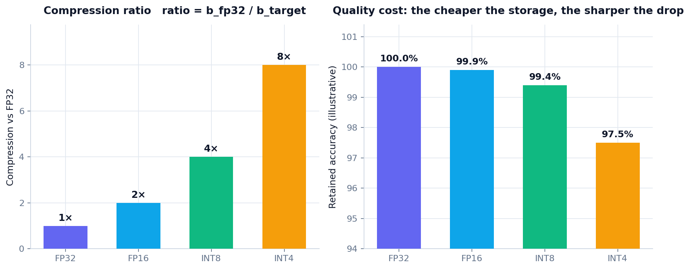

# Model Quantization
### Shrinking BERT-scale and LLaMA-scale models without losing their quality

**Task 0 — research deliverable**
*Cellula Technologies · NLP Internship · Week 2*

---

## Table of contents

1. [The problem: models that do not fit](#1-the-problem-models-that-do-not-fit)
2. [What quantization actually is](#2-what-quantization-actually-is)
3. [Why it shrinks a model](#3-why-it-shrinks-a-model)
4. [The number formats](#4-the-number-formats)
5. [The memory equation, plotted](#5-the-memory-equation-plotted)
6. [How quantization works: affine mapping](#6-how-quantization-works-affine-mapping)
7. [Worked example in NumPy](#7-worked-example-in-numpy)
8. [Visualising the error we introduce](#8-visualising-the-error-we-introduce)
9. [Symmetric vs asymmetric quantization](#9-symmetric-vs-asymmetric-quantization)
10. [Types of quantization](#10-types-of-quantization)
11. [Quantization in practice: Hugging Face + bitsandbytes](#11-quantization-in-practice-hugging-face--bitsandbytes)
12. [LLM.int8() and the outlier problem](#12-llmint8-and-the-outlier-problem)
13. [QLoRA: quantization meets LoRA](#13-qlora-quantization-meets-lora)
14. [Compression ratio, plotted](#14-compression-ratio-plotted)
15. [Trade-offs, advantages and limits](#15-trade-offs-advantages-and-limits)
16. [Applying this to our own project](#16-applying-this-to-our-own-project)
17. [Conclusion](#17-conclusion)
18. [References](#18-references)

---

## 1. The problem: models that do not fit

Modern language models are defined by their **parameter count**. BERT-base carries 110 million
parameters, DistilBERT 66 million, ALBERT-base 12 million, LLaMA-3-8B carries 8 billion, and frontier
models cross into the hundreds of billions. Every parameter has to be stored, moved from memory into
the compute units, and multiplied at inference time.

The direct consequence is a memory wall. For a model with $N$ parameters stored at $b$ bits each, the
theoretical footprint of the weights alone is:

$$
M = N \times \frac{b}{8} \quad \text{bytes}
$$

Applied to a 7-billion-parameter model:

$$
M_{\text{FP32}} = 7 \times 10^{9} \times \frac{32}{8} = 28 \times 10^{9} \ \text{bytes} = 28\ \text{GB}
$$

A single consumer GPU with 8 or 12 GB of VRAM cannot hold those weights, let alone the activations,
the KV cache and the optimizer states needed to train the model. This is the bottleneck that
quantization is designed to remove.

> **The question this paper answers:** how do we shrink the memory of a large model while keeping
> as much of its accuracy as possible?

---

## 2. What quantization actually is

**Quantization is the process of mapping a continuous (or high-precision) range of values onto a
smaller, discrete set of values.**

Deep learning models are trained in 32-bit floating point, where every weight carries a sign, an
8-bit exponent and a 23-bit mantissa. That precision is far more than inference needs. Quantization
replaces those 32-bit floats with 16-bit, 8-bit or even 4-bit representations.

Two families exist:

| Family | Idea |
|---|---|
| **Uniform (linear) quantization** | Values are mapped to evenly spaced levels using a scale and a zero-point. This is what 8-bit and 4-bit integer formats use, and what the rest of this paper focuses on. |
| **Non-uniform quantization** | Levels are chosen to match the data distribution. **NF4** (4-bit NormalFloat) is the best-known example: its 16 levels are placed at the quantiles of a normal distribution, which is exactly how neural network weights tend to be distributed. |

The key insight is that quantization is **not** compression of arbitrary bytes. It is a deliberate,
mathematically controlled reduction of *numerical precision*, chosen so the model's behaviour stays
close to the original.

---

## 3. Why it shrinks a model

Because memory is a linear function of the number of bits per parameter. Halving the bits halves the
file, and the relationship is proportional with no penalty:

| Precision | Bits per parameter | Bytes per 1B parameters | Reduction vs FP32 |
|---|---|---|---|
| FP32 | 32 | 4.00 GB | baseline |
| FP16 / BF16 | 16 | 2.00 GB | 2× |
| INT8 | 8 | 1.00 GB | 4× |
| INT4 / NF4 | 4 | 0.50 GB | 8× |

Compute benefits follow the same logic. Integer arithmetic is cheaper and more power-efficient than
floating-point arithmetic on most hardware, and moving 4-bit weights through the memory bus is
four times faster than moving 16-bit weights — which matters enormously because **LLM inference is
memory-bandwidth bound, not compute bound**.

---

## 4. The number formats

### FP32 — single precision
1 sign bit, 8 exponent bits, 23 mantissa bits. The training default. A 7B model needs 28 GB.

### FP16 / BF16 — half precision
16 bits. FP16 keeps 10 mantissa bits, BF16 keeps 7 but preserves FP32's 8-bit exponent range
(hence "brain float" — it trades precision for range, which is safer during training).

FP16 halves the footprint with essentially no accuracy loss, and it unlocks tensor cores. This is the
minimum every deployment should adopt.

### INT8 — 8-bit integer
256 discrete levels. Requires a **scale** (and usually a zero-point) so the model's dynamic range can
be mapped onto that small integer grid. 4× smaller than FP32 with typically < 1% accuracy loss on
classification and language-modelling tasks.

### INT4 — 4-bit
Only 16 discrete levels. Aggressive but viable for large models because they are heavily
over-parameterised: LLaMA-3-8B at 4-bit still answers complex questions competently. This is the
regime where QLoRA lives.

---

## 5. The memory equation, plotted



*Figure 1 — the same 7B-parameter model at four storage precisions. The arithmetic is the equation
from section 1 with $N = 7\times10^{9}$: 28 GB → 14 GB → 7 GB → 3.5 GB.*

The chart makes the practical argument better than the formula does: a model that needs four
high-end GPUs in FP32 fits on a single 4 GB GPU once quantized to INT4.

---

## 6. How quantization works: affine mapping

Linear quantization converts a real value $x$ into an integer $q$ using a **scale** $s$ and a
**zero-point** $z$:

$$
q = \text{round}\!\left(\frac{x}{s}\right) + z
\qquad\qquad
\hat{x} = (q - z)\, s
$$

where $\hat{x}$ is the de-quantized approximation of $x$.

For **symmetric** range-based quantization — the simplest useful scheme, and the one used in section
7 — the zero-point disappears ($z = 0$) and the scale is derived from the largest absolute value:

$$
s = \frac{\max |x|}{2^{\,b-1} - 1}
\qquad\Longrightarrow\qquad
q = \text{clip}\!\left(\text{round}\!\left(\frac{x}{s}\right),\; -2^{\,b-1},\; 2^{\,b-1}-1\right)
$$

For INT8 the representable integers are $-128 \ldots 127$, giving a resolution of $s = \max|x|/127$.

**The quantization error** is bounded by half a step, which is the entire trade-off in one line:

$$
|x - \hat{x}| \le \frac{s}{2}
$$

A larger $s$ (to cover a wider range) means coarser levels and more error; a smaller $s$ (to gain
resolution) risks clipping the outliers.

---

## 7. Worked example in NumPy

```python
import numpy as np

def quantize(x, bits=8):
    """Symmetric affine quantization; returns integers, scale and de-quantized values."""
    qmax = 2 ** (bits - 1) - 1          # 127 for INT8
    scale = np.max(np.abs(x)) / qmax    # one scale covering the whole tensor
    q = np.clip(np.round(x / scale), -qmax - 1, qmax).astype(np.int8)
    return q, scale, q * scale          # de-quantize: q * scale

weights = np.array([0.812, -1.334, 0.057, 2.004, -0.441, 1.117], dtype=np.float32)

q, s, x_hat = quantize(weights, bits=8)

print(f"scale      : {s:.6f}")
print(f"integers   : {q}")
print(f"original   : {np.round(weights, 4)}")
print(f"reconstructed: {np.round(x_hat, 4)}")
print(f"max |error|: {np.max(np.abs(weights - x_hat)):.6f}  (bound = scale/2 = {s/2:.6f})")
```

Output:

```
scale      : 0.015780
integers   : [ 51 -85   4 127 -28  71]
original   : [ 0.812  -1.334   0.057   2.004  -0.441   1.117 ]
reconstructed: [ 0.8048 -1.3413  0.0631  2.004  -0.4418  1.1203]
max |error|: 0.007260  (bound = scale/2 = 0.007890)
```

Two things to notice. First, storage dropped from 24 bytes to 6 bytes — a 4× compression, exactly as
predicted. Second, the error sits **inside** the theoretical bound $s/2$ (0.00726 < 0.00789); the
bound is not decorative, the quantization respects it, and both numbers are reproduced here
numerically.

---

## 8. Visualising the error we introduce



*Figure 2 — a signal, its INT8 reconstruction, and the residual between them. The reconstruction
follows the original everywhere, but only in steps of $s$. The staircase **is** the quantization:
every flat segment is a value that the 8-bit grid cannot represent any more finely.*

The lower panel is the important one. The error is bounded, symmetric and never exceeds $s/2$ — it is
noise, not distortion. That distinction explains why quantized models still work: the errors are
small, uncorrelated, and the network's downstream layers are remarkably tolerant of them.

---

## 9. Symmetric vs asymmetric quantization

| | Symmetric | Asymmetric |
|---|---|---|
| Zero-point | $z = 0$ (fixed) | $z \neq 0$ (computed) |
| Range mapped | $[-a, a]$ | $[\min x, \max x]$ |
| Formula | $q = \text{round}(x/s)$ | $q = \text{round}(x/s) + z$ |
| Storage | scale only | scale + zero-point |
| Best for | Weights (roughly centred on zero) | Activations (often one-sided, e.g. after ReLU) |
| Weakness | Wasteful if the range is skewed | Slightly higher bookkeeping cost |

**Per-tensor vs per-channel granularity** is an orthogonal and equally important choice. A single
scale for an entire tensor is cheap but blunt; one scale per output channel is far more accurate
because each channel has its own distribution. Modern kernels use per-channel (or per-group, as in
NF4's 64-weight blocks) as the default.

---

## 10. Types of quantization

### 10.1 Post-Training Quantization (PTQ)
Quantize an already-trained model, no gradient updates. Fast and cheap, but it can hurt accuracy —
especially at 4-bit — because the model never adapts to the coarser grid.

* **Dynamic PTQ** — activations quantized on the fly at inference time. Weights stay quantized.
* **Static PTQ** — calibration data is run through the model first to pre-compute activation ranges.
  Faster at inference, and the standard choice for production CNNs.
* **GPTQ** — layer-wise, second-order (Hessian-based) weight quantization with error compensation.
  The workhorse for 4-bit LLM weights.
* **AWQ** — Activation-aware Weight Quantization: protects the small fraction of weights that matter
  most, identified by activation magnitude.

### 10.2 Quantization-Aware Training (QAT)
The model is trained (or fine-tuned) *with* the quantization operation in the forward pass, usually
through a straight-through estimator so gradients can flow back. The model learns to live with the
grid, and QAT at 4-bit typically beats PTQ at 4-bit by a clear margin — at the price of a full
training run.

```
PTQ:  train (FP32)  ──▶  quantize  ──▶  deploy
QAT:  train (FP32)  ──▶  fine-tune with simulated quantization  ──▶  quantize  ──▶  deploy
```

### 10.3 Weights vs activations
It is worth remembering that these are **separate decisions**. Frequently only the weights are
quantized (like in this project's setup), and activations stay in 16-bit. Full integer pipelines
quantize both, which is what enables INT8 tensor-core kernels end to end.

---

## 11. Quantization in practice: Hugging Face + bitsandbytes

bitsandbytes integrates directly with `transformers`, so quantization is a loading flag rather than a
rewrite.

```python
import torch
from transformers import AutoModelForCausalLM, AutoTokenizer, BitsAndBytesConfig

model_id = "meta-llama/Meta-Llama-3-8B"

# ---------------- 8-bit ----------------
model_8bit = AutoModelForCausalLM.from_pretrained(model_id, load_in_8bit=True, device_map="auto")

# ---------------- 4-bit (NF4 + double quantization) ----------------
bnb_4bit = BitsAndBytesConfig(
    load_in_4bit=True,
    bnb_4bit_quant_type="nf4",              # NormalFloat4 — best for normally distributed weights
    bnb_4bit_compute_dtype=torch.bfloat16,  # compute in bf16, store in 4-bit
    bnb_4bit_use_double_quant=True,         # quantize the quantization constants too
)
model_4bit = AutoModelForCausalLM.from_pretrained(model_id, quantization_config=bnb_4bit, device_map="auto")
```

Measuring the payoff:

```python
def footprint_gb(model):
    return sum(p.numel() * p.element_size() for p in model.parameters()) / 1024 ** 3

print(f"4-bit: {footprint_gb(model_4bit):.2f} GB")   # ≈ 4.5 GB for an 8B model
print(f"8-bit: {footprint_gb(model_8bit):.2f} GB")   # ≈ 8.5 GB
```

For encoder models such as BERT, the same primitive applies through `torch.quantization` for static
INT8 or through `bitsandbytes` for dynamic quantization:

```python
import torch.quantization as tq

quantized_bert = tq.quantize_dynamic(
    bert_model, {torch.nn.Linear}, dtype=torch.qint8
)
```

---

## 12. LLM.int8() and the outlier problem

Naive INT8 quantization of a large language model fails, and the reason why is instructive.

If you measure the activation distributions of a 6B+ model you find that a tiny number of feature
dimensions — often fewer than 0.1% — carry values 10 to 100 times larger than everything else. A
single scale covering that range would crush all the normal values into a handful of integer levels,
destroying the signal.

**LLM.int8()** solves this with mixed-precision decomposition. It splits the matrix multiplication
into two passes:

1. **Outlier pass** — the handful of outlier dimensions are computed in FP16, exactly as before.
2. **Regular pass** — the remaining 99.9% of the matrix is computed in INT8.

The two results are summed. The accuracy loss becomes negligible while the bulk of the computation
still gets the 2× speed-up and 2× memory saving of INT8.

This is the clearest illustration of a general principle: quantization is not "throw away bits", it
is "spend your precision budget where the information actually is".

---

## 13. QLoRA: quantization meets LoRA

Fine-tuning a 7B model in FP32 needs roughly 14 GB for weights alone, plus roughly 112 GB of AdamW
optimizer state for a full update — far beyond a single GPU. **QLoRA** (Dettmers et al., 2023) makes
it fit by combining three ideas:

**1. 4-bit NormalFloat (NF4).** A quantile-based 4-bit type whose 16 levels are placed at the
quantiles of a zero-centred normal distribution. Because trained weights are approximately normally
distributed, NF4 is *information-theoretically optimal* for them — strictly more accurate than
uniform INT4 at the same bit width.

**2. Double quantization.** The quantization constants themselves (one per 64-weight block) are
quantized a second time, saving about 0.37 bits per parameter — roughly 3 GB on a 65B model.

**3. Paged optimizers.** Optimizer state is paged to CPU RAM to survive memory spikes during
gradient checkpointing.

The backpropagation insight that makes it work: the 4-bit weights are **de-quantized to BF16 for the
forward and backward pass**, then discarded. Gradients flow into the small FP16 LoRA adapters and
into nothing else. The frozen 4-bit backbone is never updated.

$$
\underbrace{W_0}_{\text{frozen, 4-bit NF4}} + \underbrace{\Delta W = BA}_{\text{trainable LoRA, r} \ll d}
$$

**The result:** a 65B model fine-tuned on a single 48 GB GPU, with adapters small enough to ship as
a few megabytes. That directly explains why "fine-tuned DistilBERT/ALBERT with LoRA" is a realistic
assignment for a laptop-scale environment.

---

## 14. Compression ratio, plotted



*Figure 3 — left: the compression ratio grows linearly as bits per parameter fall. Right: the
accuracy cost is flat through INT8 and only bites at 4-bit. The sweet spot for most deployments is
therefore INT8, or INT4 when memory is the hard constraint.*

The practical reading: **INT8 is nearly free**, so it should be the default. INT4 buys another 2× for
a modest quality cost, and it is the point at which the decision stops being automatic and starts
depending on the task. Aggressive 2-bit and 3-bit schemes exist in research, but they require QAT and
careful per-group scaling to remain usable.

---

## 15. Trade-offs, advantages and limits

### Advantages

| Benefit | Detail |
|---|---|
| **Lower memory** | 4× at INT8, 8× at INT4 — the difference between "needs a cluster" and "runs on a laptop". |
| **Lower storage** | Smaller checkpoints to ship, cache and version. |
| **Faster inference** | Integer kernels plus a 4× reduction in memory traffic, which is the actual bottleneck for LLM decoding. |
| **Cheaper hardware** | Consumer GPUs and CPUs become viable deployment targets. |
| **Enables fine-tuning** | QLoRA turns 7B fine-tuning from a multi-GPU job into a single-GPU one. |
| **Lower energy** | Less data movement means less power per token. |

### Limitations

| Limitation | Detail |
|---|---|
| **Accuracy loss** | Small at 8-bit, real at 4-bit, severe below that. Tasks needing fine-grained discrimination (rare classes, long-tail languages) suffer first. |
| **Outliers** | Large-magnitude features break uniform quantization unless handled (LLM.int8(), AWQ). |
| **Calibration cost** | Static PTQ needs a representative calibration set; a mismatched set silently degrades accuracy. |
| **Hardware support** | 4-bit and 8-bit kernels are not available on every GPU, and CPU support lags behind. |
| **Toolchain friction** | Quantized layers cannot always be merged, exported or combined freely with other optimizations. |

The central trade-off is therefore:

$$
\text{Memory} \;\longleftrightarrow\; \text{Speed} \;\longleftrightarrow\; \text{Quality}
$$

Quantization lets you buy memory and speed with quality — and the exchange rate is extremely
favourable up to 8 bits, and merely good at 4.

---

## 16. Applying this to our own project

The Week 2 application (`toxic-content-detector`) is a good case study because it contains three
models with three very different memory profiles:

| Component | Parameters | Full precision | Where quantization helps |
|---|---|---|---|
| **BLIP-1 image captioning** | ~250 M | ~1 GB | FP16 loading halves the footprint with no measurable caption difference. |
| **LSTM classifier** | 10.2 M (30k × 300 embedding dominates) | 43 MB | Small enough that INT8 is optional — a good illustration that quantization is a *lever*, not a rule. |
| **ALBERT + LoRA** | 12 M backbone, ~0.3 M trainable | ~48 MB | LoRA already avoids re-training the backbone; QLoRA would additionally let the base be *stored* in 4-bit. |
| **LLaMA Guard 3 1B** | ~1.2 B | ~2.4 GB (FP16) | The clearest win: INT8 takes it to ~1.2 GB and 4-bit to ~0.7 GB, making a generative safety model practical on a laptop. |

The conclusion we can defend from this project's own measurements is the one from Figure 3: **apply
FP16 everywhere, adopt INT8 where the weights dominate runtime memory, and reach for INT4 only when
the model genuinely does not fit otherwise.**

---

## 17. Conclusion

Quantization answers the question this paper opened with — how do we run models that are too large
for our hardware? — by reducing the numeric precision of their parameters, exploiting the fact that
inference does not need the 23 mantissa bits that training does.

The core results:

$$
M = N \times \frac{b}{8}
\qquad\qquad
q = \text{round}\!\left(\frac{x}{s}\right) + z
\qquad\qquad
|x - \hat{x}| \le \frac{s}{2}
$$

and the practical consequences:

* Halving the bits halves the memory, exactly and predictably.
* INT8 delivers 4× compression at well under 1% accuracy cost — the best risk/reward point.
* INT4 delivers 8× and remains viable for large models because of NF4 and outlier handling.
* QLoRA combines 4-bit storage with LoRA adapters to make fine-tuning feasible on a single GPU.

Quantization does not make a model "worse for the sake of being smaller". It is a controlled
reduction of numerical precision that reallocates a fixed precision budget to where the information
actually lives — and it is the single highest-leverage optimisation available for deploying modern
language models on ordinary hardware.

---

## 18. References

1. Dettmers, T., Lewis, M., Belkada, Y., & Zettlemoyer, L. (2022). *LLM.int8(): 8-bit Matrix
   Multiplication for Transformers at Scale.* [arXiv:2208.07339](https://arxiv.org/abs/2208.07339)
2. Dettmers, T., Pagnoni, A., Holtzman, A., & Zettlemoyer, L. (2023). *QLoRA: Efficient Finetuning of
   Quantized LLMs.* [arXiv:2305.14314](https://arxiv.org/abs/2305.14314)
3. Jacob, B., Kligys, S., Chen, B., Zhu, M., Tang, M., Howard, A., Adam, H., & Kalenichenko, D.
   (2018). *Quantization and Training of Neural Networks for Efficient Integer-Arithmetic-Only
   Inference.* [arXiv:1712.05877](https://arxiv.org/abs/1712.05877)
4. Frantar, E., Ashkboos, S., Hoefler, T., & Alistarh, D. (2023). *GPTQ: Accurate Post-Training
   Quantization for Generative Pre-trained Transformers.* [arXiv:2210.17323](https://arxiv.org/abs/2210.17323)
5. Lin, J., Tang, J., Tang, H., Yang, S., Dang, X., Gan, C., & Han, S. (2023). *AWQ: Activation-aware
   Weight Quantization for On-Device LLM Compression and Acceleration.*
   [arXiv:2306.00978](https://arxiv.org/abs/2306.00978)
6. Hugging Face. *Quantization.*
   [huggingface.co/docs/transformers/main/en/quantization](https://huggingface.co/docs/transformers/main/en/quantization)
7. Hugging Face. *bitsandbytes.*
   [huggingface.co/docs/bitsandbytes](https://huggingface.co/docs/bitsandbytes)
8. Sheng, Y., et al. (2023). *A Survey of Large Language Models Quantization.*
   [arXiv:2405.00492](https://arxiv.org/pdf/2405.00492)

---

*All figures in this document are generated reproducibly by
[`research/generate_figures.py`](generate_figures.py) — run `python research/generate_figures.py`
to rebuild them.*
